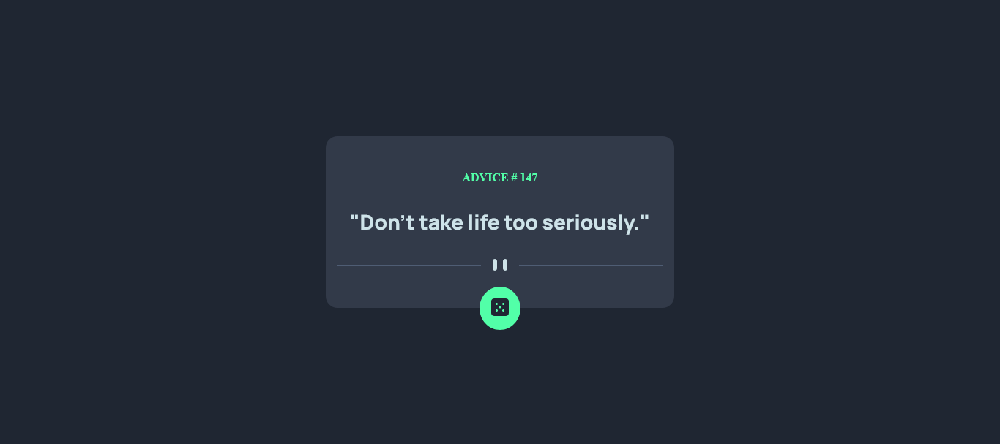

# Frontend Mentor - Advice generator app solution

This is a solution to the [Advice generator app challenge on Frontend Mentor](https://www.frontendmentor.io/challenges/advice-generator-app-QdUG-13db). Frontend Mentor challenges help you improve your coding skills by building realistic projects.

## Table of contents

- [Overview](#overview)
  - [The challenge](#the-challenge)
  - [Screenshot](#screenshot)
  - [Links](#links)
  - [Built with](#built-with)
- [Author](#author)

## Overview

### The challenge

Users should be able to:

- See hover states for all interactive elements on the page
- Generate a new piece of advice by clicking the dice icon

### Screenshot

### Links

- Solution URL: [Add solution URL here](https://github.com/FefeAlvarez/advice-generator-app)
- Live Site URL: [Add live site URL here](https://advice-generator-app-nine-lake.vercel.app/)

### Built with

- Semantic HTML5 markup
- CSS custom properties
- Flexbox
- [React](https://reactjs.org/) - JS library

## Author

- Website - [Federico Alvarez](https://github.com/FefeAlvarez)
- Frontend Mentor - [@FefeAlvarez](https://www.frontendmentor.io/profile/FefeAlvarez)
